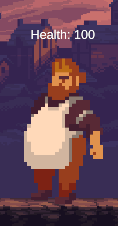
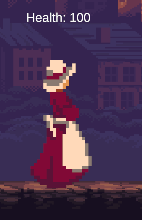
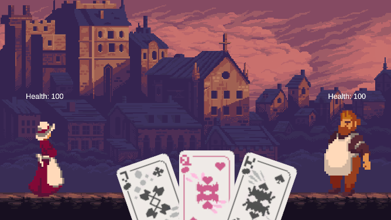

# RPG Game - DeckBreaker
Fundamentals of Game Development (FGCT4015)

Bradley Curtis

2309516

## Research
### Relevant sources and references
#### Dice Task

- As I have used C# in the past i was already familiar with the Random.Range funcion however I wanted to look into displaying the output values in a text box within the canvas rather than displaying using Debug.Log.


#### Battle System

- Using Namespaces to allow scrips to use returned a int from another script was something new I had to look more into for this step of the game but i wanted to add more polish onto the cards and make them move when the player hovers over them.

#### Game Loop

- At this point in the game I was getting more comfortable with the game logic however i wanted to make the game feel more like a turned based card game, so i looked into using Coroutine to basically pause the game and continue after a set interval.

- In the past I have relied on video tutorials but wanting to move away from that I decided throughout the project to only look at the Unity Documentation and Discussions websites.


## Implementation

- Initially i wanted to create a text based RPG game similar to '80 Days' however i soon realised that this task would be too ambitious for the time given abd on the limited amount of knowledge I had on creating games. (www.inklestudios.com, n.d.) 

- After doing some more research into 2D games, a subgenre of card games caught my attention, especially the game Slay The Spire. (Megacrit.com, 2024)

- After looking into 2D card games more I thought of the idea of using cards as a means of attacking similar to Slay The Spire, whilst also implementing the dice roll mechanic in a way that when a card is used to do an attack, the game will roll a dice and do damage equal to the outcome of the roll (not taking into account the probability to miss the attack or do critical strikes). 

---

- Firstly I started with making the Random.Range rolls for the dice and how the interact within the game.

```csharp
public void RollDice()
    {
        int dice6Result = RollDice(6);
        int dice12Result = RollDice(12);
        int dice20Result = RollDice(20);

        dice6ResultText.text = "6 Sided Dice Roll: " + dice6Result;
        dice12ResultText.text = "12 Sided Dice Roll: " + dice12Result;
        dice20ResultText.text = "20 Sided Dice Roll: " + dice20Result;
    }

    private int RollDice(int sides)
    {
        return Random.Range(1, sides+1);
    }
```
- With the basic idea of the rolling dice done, I thought of how I was going to make the cards work with their various attack chances and damage. Below is how I implemented that.


```csharp
private int RollDice(int sides)
        {
            return Random.Range(1, sides+1);
        }

        public void Attack(CardType cardType)
        {
            switch(cardType)
            {
                case CardType.Pierce: PierceCard(); break;
                case CardType.Cleave: CleaveCard(); break;
                case CardType.Slash: SlashCard(); break;
            }
        }
        // Different types of cards
        public void PierceCard()//Low damage but high probability of hitting
        {
            if (isPlayerTurn)
            {
                Pierce = RollDice(6);
                if (Pierce <= 1)
                {
                    Attack(0);
                    Debug.Log("Missed");                
                }
                else if(Pierce == 6)
                {
                    Attack(Pierce + 2);
                    Debug.Log("Critical Hit! You did 8 Damage");
                }
                else
                {
                    Attack(Pierce);
                    Debug.Log("Pierced for " + Pierce + " damage!");
                }
            
            }
        }
        public void SlashCard()//middle-ground card in terms of damage and probability
        {
            if (isPlayerTurn)
            {
                Slash = RollDice(12);
                if (Slash <= 4)
                {
                    Attack(0);
                    Debug.Log("Missed");
                }
                else if (Slash == 12)
                {
                    Attack(Slash + 4);
                    Debug.Log("Critical Hit! You did 16 Damage");
                }
                else
                {
                    Attack(Slash);
                    Debug.Log("Slashed for " + Slash + " damage!");
                }
            }
        }
        public void CleaveCard()// high risk / high reward
        {
            if (isPlayerTurn)
            {
                Cleave = RollDice(20);
                if (Cleave <= 12)
                {
                    Attack(0);
                    Debug.Log("Missed");
                }
                else if(Cleave == 20)
                {
                    Attack(Cleave + 10);
                    Debug.Log("Critical Hit! You did 30 Damage");
                }
                else
                {
                    Attack(Cleave);
                    Debug.Log("Cleaved for " + Cleave + " damage!");
                }
            
            }
        }
```
- After making the cards I needed the cards to acually be able to damage an enemy and for the enemy to retaliate and attack the player back in turn. 


```csharp
public void TakeDamage(int damage)
    {
        currentHealth -= damage;
        Debug.Log("Enemy took " + damage + " damage. Current Health: " + currentHealth);
        UpdateHealthText();

        if (currentHealth <= 0)
        {
            Die();
        }
    }
    
    public void AttackPlayer()
    {
        if (player != null)
        {
            AtkDamage = Random.Range(0, 16);
            Debug.Log("You were hit with " + AtkDamage + " damage");
            player.TakingDamage(AtkDamage);
        }
    }
    private void UpdateHealthText()
    {
        enemyHealthText.text = "Health: " + currentHealth.ToString();
    }
    private void Die()
    {
        SceneManager.LoadScene(2);
    }
}
```

- After being able to attack the enemy, it attacked back instantly not leaving any time for the player to properly take not of how much damage they dealt or recieved so I researched how to make the game feel more like its acting on a turn based system and found that using a coroutine. (Unity Technologies, 2020)

```csharp
private void Attack(int damage)
        {
            if (enemy != null)
            {
                enemy.TakeDamage(damage);
                damageText.DisplayDamage(damage);
                isPlayerTurn = false;
                StartCoroutine(EnemyTurn());
            }
        }   

private IEnumerator EnemyTurn()
        {
            yield return new WaitForSeconds(1f);
            if(enemy != null)
            {
                enemy.AttackPlayer();
            }
            isPlayerTurn = true;
        }          
```

- Finally, for the game to actually work I needed a player model to help with the visual aspect of the player taking damage and then also display remaning health over the player and enemies head so that the player doesnt have to guess whay theyre doing.



```csharp
public void TakingDamage(int damage)
        {
            currentHealth -= damage;
            Debug.Log("Took " + damage +" damage!");
            UpdateHealthText();
            if (currentHealth<0)
            {
                currentHealth = 0;
                Death();
            }
        }

        private void Death()
        {
            Debug.Log("You Died");
        }
        private void UpdateHealthText()
        {
            healthText.text = "Health: " + currentHealth.ToString();
        }
```

## Outcome



[Link to the game on Itch.io](https://popegames.itch.io/deckbreaker)

[Link to gameplay video demonstration](https://youtu.be/AgcwLI86LdQ)

[Link to Github repository](https://github.com/2309516/RPG_Game)

## Critical Reflection
- For this being my first attempt at making a 2D logic based game in Unity, I am pleased with the final working result. 

- With finish off the develpment journal closer to the submission deadline, looking back at the game there are a few aspects in which I wish I had spent more time in. With the knowledge I have now I wouldve liked to have some more time to make the game feel more polished, possibly add more enemies and a wider variety of cards however this doesnt take away from the work I have done.

- At the very beginning of the game I found myself watching youtube tutorials for how to do specific things but I had managed to break that habit early and I have found myself much better off for it.


## Bibliography

www.inklestudios.com. (n.d.). 80 Days - inkle’s award-winning narrative adventure. [online] Available at: https://www.inklestudios.com/80days/.

‌Megacrit.com. (2024). Games - Mega Crit Games. [online] Available at: https://www.megacrit.com/games/ [Accessed 4 Dec. 2024].

‌Unity Technologies (2020). Unity - Scripting API: Coroutine. [online] Unity3d.com. Available at: https://docs.unity3d.com/2020.1/Documentation/ScriptReference/Coroutine.html.

Unity Technologies (2012). Please explain a switch statement? [online] Unity Discussions. Available at: https://discussions.unity.com/t/please-explain-a-switch-statement/36541 [Accessed 12 Oct. 2024].

‌

## Declared Assets

assetstore.unity.com. (n.d.). GothicVania Town | 2D Characters | Unity Asset Store. [online] Available at: https://assetstore.unity.com/packages/2d/characters/gothicvania-town-101407.

‌Gvidon (2024). Spinning Head | Royalty-free Music. [online] Pixabay.com. Available at: https://pixabay.com/music/trap-spinning-head-271171/ [Accessed 4 Dec. 2024].

‌Free poker cards! by hanker (no date) itch.io. Available at: https://argametina.itch.io/free-poker-cards (Accessed: 18 Oct 2024). 
